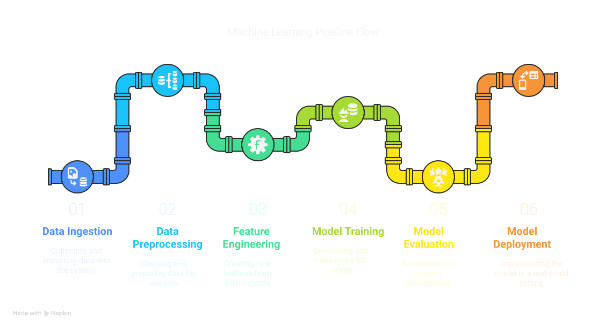

# 🏦 Bank Customer Churn Prediction: End-to-End ML Pipeline


This project implements an end-to-end machine learning pipeline for predicting bank customer churn using PySpark, DVC (Data Version Control), and AWS. The pipeline includes data ingestion, preprocessing, feature engineering, model training, and evaluation, with plans for deployment via FastAPI and a web interface.

## 📊 Project Overview

[](https://www.python.org/)
[](https://spark.apache.org/docs/latest/api/python/)
[](https://dvc.org/)
[](https://fastapi.tiangolo.com/)
[](https://aws.amazon.com/)
[](https://opensource.org/licenses/MIT)
[](https://github.com/yourusername/E2E-ML-Pipeline)


### 🎯 Problem Statement
Predicting customer churn in banking is crucial for maintaining a healthy customer base. This project uses machine learning to identify customers likely to leave the bank, enabling proactive retention measures.

### 📂 Dataset
The project uses the [Bank Customer Churn Dataset](https://www.kaggle.com/datasets/gauravtopre/bank-customer-churn-dataset/data) from Kaggle.

#### Dataset Summary
- **Size**: 10,000 customer records
- **Target Variable**: Churn (Yes/No)
- **Features**: 11 input features including:
  - 👥 Demographics: Age, Gender, Country
  - 💰 Banking Info: Balance, Credit Score, Products
  - 📱 Behavioral: Active Status, Credit Card Usage
- **Class Distribution**: 
  - 🔴 Churned Customers: 20.37% (2,037)
  - 🟢 Retained Customers: 79.63% (7,963)
- **Geographic Coverage**: 🇫🇷 France, 🇪🇸 Spain, 🇩🇪 Germany
- **Balance Range**: €0 - €250,898
- **Age Range**: 18-92 years

### 📈 Current Results
- Accuracy: 86.1%
- Precision: 85.3%
- F1 Score: 84.2%

## 🏗️ Technical Architecture

### 🛠️ Technologies Used
- **🚀 PySpark**: For distributed data processing and ML model training
- **📦 DVC**: For data and model version control
- **☁️ AWS S3**: For remote storage of data and models
- **🐍 Python**: Primary programming language
- **⚡ FastAPI**: (Planned) For model serving
- **💻 React**: (Planned) For web interface

### 🔄 Pipeline Components



```
src/
├── pipeline/
│   ├── ingestion.py      # 📥 Data loading from S3
│   ├── preprocessing.py   # 🧹 Data cleaning and preparation
│   ├── feature_eng.py    # ⚙️ Feature engineering
│   ├── train.py          # 🎓 Model training
│   └── evaluate.py       # 📊 Model evaluation
```

## 🚀 Getting Started

### ⚙️ Prerequisites
- Python 3.11+
- PySpark
- DVC
- AWS CLI configured

### 📥 Installation
```bash
# Clone the repository
git clone https://github.com/yourusername/E2E-ML-Pipeline.git
cd E2E-ML-Pipeline

# Create and activate virtual environment
python -m venv venv
source venv/bin/activate  # On Windows: venv\Scripts\activate

# Install dependencies
pip install -r requirements.txt
```

### ⚙️ Configuration
1. Set up AWS credentials in `.env` file:
```
AWS_ACCESS_KEY_ID=your_access_key
AWS_SECRET_ACCESS_KEY=your_secret_key
AWS_REGION=your_region
```

2. Configure DVC with S3:
```bash
dvc remote add -d myremote s3://your-bucket-name
```

## 🏃‍♂️ Running the Pipeline

### 🔄 Using DVC
The entire pipeline can be reproduced using:
```bash
dvc repro
```

This will execute all stages defined in `dvc.yaml`:
1. 📥 Data ingestion from S3
2. 🧹 Preprocessing
3. ⚙️ Feature engineering
4. 🎓 Model training
5. 📊 Evaluation

### 📝 Configuration Files
- `params.yaml`: Contains all pipeline parameters
  - 🧹 Data preprocessing settings
  - ⚙️ Feature engineering parameters
  - 🎓 Model hyperparameters
  - 📊 Evaluation metrics

## 📁 Project Structure
```
.
├── .dvc/                 # 📦 DVC configuration
├── .env                  # 🔑 Environment variables 
├── app/                  # ⚡ FastAPI application (planned)
├── src/              # 💻 Source code
├── dvc.yaml          # 🔄 DVC pipeline definition
├── params.yaml       # ⚙️ Parameters for all stages
└── requirements.txt  # 📋 Python dependencies
```

## 🔮 Future Work

### 🚀 Planned Enhancements
1. **🌐 API Development**
   - FastAPI server for model serving
   - RESTful endpoints for predictions
   - Input validation and error handling

2. **💻 Web Interface**
   - React-based frontend
   - User-friendly form for data input
   - Visualization of prediction results

3. **☁️ Cloud Deployment**
   - AWS EC2 for hosting
   - Container orchestration
   - CI/CD pipeline

### 🔍 Monitoring and Maintenance
- 📊 Model performance monitoring
- 🔄 Regular retraining pipeline
- 📈 Data drift detection

##  Medium Blog
[Project Blog](https://medium.com/@akashanandani.56/building-an-end-to-end-ml-pipeline-for-bank-customer-churn-prediction-9c754162e8d3)

## 🤝 Contributing
Contributions are welcome! Please feel free to submit a Pull Request.

## 📄 License
This project is licensed under the MIT License - see the LICENSE file for details.
